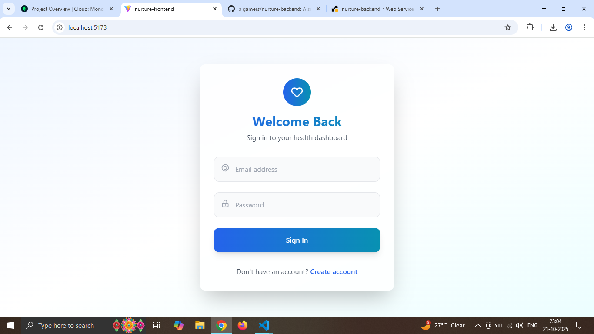
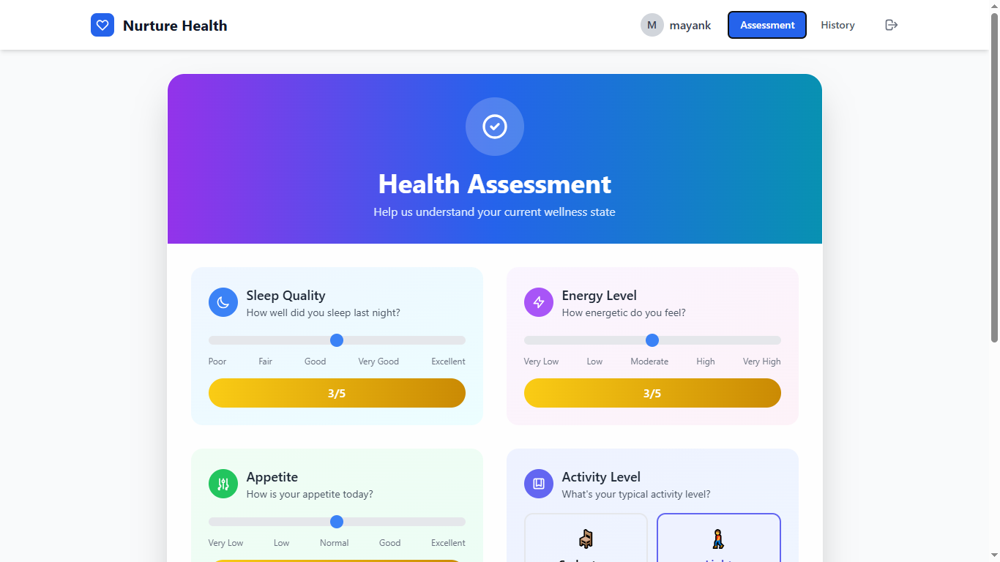
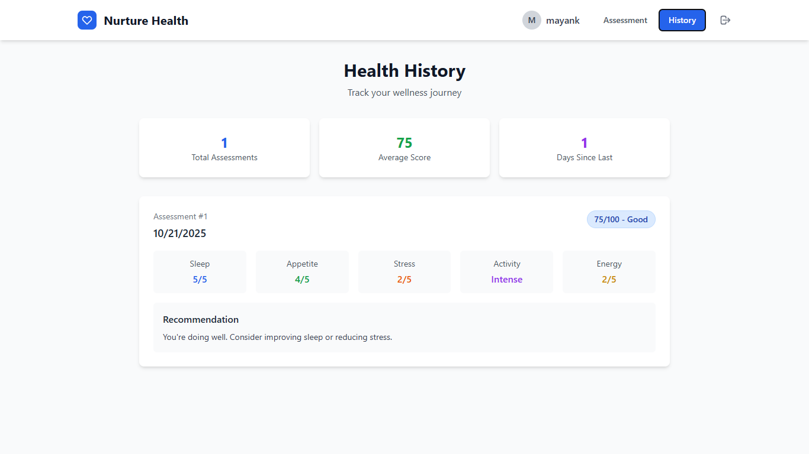

# Nurture Health Frontend

A React-based healthcare platform frontend for health assessments and wellness tracking.

## Tech Stack

- **Framework**: React 19 with Vite
- **Styling**: TailwindCSS
- **Charts**: Recharts for data visualization
- **HTTP Client**: Axios for API communication
- **State Management**: React Context API
- **Authentication**: JWT token-based auth
- **Routing**: Component-based navigation

## Setup Instructions

1. **Prerequisites**
   - Node.js 16+ installed
   - Backend server running on port 5000

2. **Install Dependencies**
   ```bash
   npm install
   ```

3. **Start Development Server**
   ```bash
   npm run dev
   ```
   Application will be available at `http://localhost:5173`

4. **Build for Production**
   ```bash
   npm run build
   npm run preview
   ```

## Project Structure

```
nurture-frontend/
├── src/
│   ├── components/
│   │   ├── Login.jsx
│   │   ├── Register.jsx
│   │   ├── HealthForm.jsx
│   │   ├── Dashboard.jsx
│   │   └── History.jsx
│   ├── AuthContext.jsx
│   ├── api.js
│   ├── App.jsx
│   └── main.jsx
└── public/
```

## Features

- **Authentication**: Secure login/register with JWT
- **Health Assessment**: 5-metric evaluation form
- **Dashboard**: Visual results with charts
- **History Tracking**: Past assessments overview
- **Responsive Design**: Mobile-friendly interface
- **Real-time Scoring**: Instant health score calculation

## Health Assessment Metrics

1. **Sleep Quality** (1-5): Sleep quality rating
2. **Appetite** (1-5): Appetite level assessment
3. **Stress Level** (1-5): Current stress evaluation
4. **Activity Type**: Physical activity level selection
5. **Energy Level** (1-5): Overall energy assessment

## Screenshots

### Login Screen

*Clean authentication interface with gradient design*

### Health Assessment Form

*Interactive assessment form with range sliders and activity selection*

### Results Dashboard

*Health score visualization with pie charts and recommendations*

### History View

*Past assessments tracking with detailed metrics*

## Demo

[View Live Demo](https://your-demo-link.com)

## API Integration

Connects to backend API at `http://localhost:5000/api`:
- User authentication endpoints
- Health assessment submission
- Historical data retrieval
- JWT token management

## Environment Setup

Ensure backend server is running before starting frontend development.